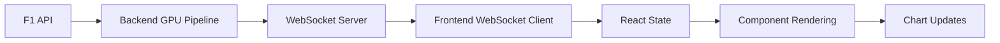

# F1 GPU Telemetry System - Frontend

Real-time React dashboard for Formula 1 telemetry visualization and race prediction analytics.

## 🎯 Overview

The frontend provides a modern, responsive dashboard for visualizing real-time F1 telemetry data, race predictions, and system analytics. Built with React and modern web technologies, it delivers sub-second updates and interactive data visualization.

## 🚀 Features

### Real-Time Telemetry
- **Live speed, throttle, and brake data** with 50Hz update rate
- **Interactive track position map** showing driver locations
- **Tire temperature monitoring** with 4-corner visualization
- **Sector timing analysis** with performance breakdown

### AI-Powered Predictions
- **Race outcome predictions** with position probability distributions
- **Lap time forecasting** using LSTM models
- **Pit strategy recommendations** with optimal timing
- **Performance analytics** and driver comparisons

### System Monitoring
- **GPU utilization metrics** with real-time graphs
- **Processing pipeline status** with latency monitoring
- **Kubernetes cluster health** with resource usage
- **WebSocket connection management** with auto-reconnect

### Interactive Visualizations
- **Recharts integration** for responsive charting
- **Canvas-based track map** with real-time car positions
- **Tabbed interface** for organized data viewing
- **Dark theme optimized** for race control environments

## 📁 Project Structure

### Current State (Existing Files)
```
frontend/
└── src/
    └── App.jsx              ✅ Large monolithic component (needs refactoring)
```

### Target Architecture (To Be Created)
```
frontend/
├── public/                     # Static assets [📋 TODO]
│   ├── index.html             # Main HTML template [📋 TODO]
│   └── favicon.ico            # Application icon [📋 TODO]
├── src/                       # Source code
│   ├── components/            # React components [📋 TODO]
│   │   ├── Header.jsx         # Application header [✅ Created]
│   │   ├── ConnectionStatus.jsx # WebSocket status [✅ Created]
│   │   ├── charts/            # Chart components [📋 TODO - Extract from App.jsx]
│   │   │   ├── TelemetryChart.jsx
│   │   │   ├── RaceOutcomePrediction.jsx
│   │   │   └── TrackPositionMap.jsx
│   │   ├── tabs/              # Tab content components [📋 TODO - Extract from App.jsx]
│   │   │   ├── LiveTelemetryTab.jsx
│   │   │   ├── PredictionsTab.jsx
│   │   │   ├── AnalyticsTab.jsx
│   │   │   └── SystemTab.jsx
│   │   └── ui/                # Reusable UI components [📋 TODO]
│   │       ├── card.jsx       # Shadcn/ui components
│   │       ├── badge.jsx
│   │       ├── button.jsx
│   │       ├── tabs.jsx
│   │       ├── alert.jsx
│   │       └── progress.jsx
│   ├── hooks/                 # Custom React hooks
│   │   ├── useWebSocket.js    # WebSocket management [✅ Created]
│   │   ├── useTelemetryData.js # Data state management [✅ Created]
│   │   └── useChartData.js    # Chart data processing [📋 TODO]
│   ├── utils/                 # Utility functions [📋 TODO]
│   │   ├── formatters.js      # Data formatting
│   │   ├── calculations.js    # Performance calculations
│   │   └── constants.js       # Application constants
│   ├── styles/                # CSS and styling [📋 TODO]
│   │   ├── globals.css        # Global styles
│   │   └── components.css     # Component-specific styles
│   ├── App.jsx               # Main application component [🔄 Needs refactoring]
│   ├── index.js              # Application entry point [📋 TODO]
│   └── index.css             # Main CSS file [📋 TODO]
├── package.json              # Dependencies and scripts [📋 TODO]
├── tailwind.config.js        # Tailwind CSS configuration [📋 TODO]
├── vite.config.js            # Vite build configuration [📋 TODO]
├── .env.example              # Environment template [📋 TODO]
└── README.md                 # This file [✅ Created]
```

**Legend:**
- ✅ **Created** - Component exists and ready to use
- 🔄 **Needs Refactoring** - Exists but should be broken down
- 📋 **TODO** - Needs to be created
- 🚀 **Future** - Planned for later iterations

## 🛠️ Technology Stack

### Core Framework
- **React 18.2+** - Component-based UI framework
- **Vite 4.x** - Fast build tool and dev server
- **TypeScript** - Optional static typing (if enabled)

### Styling & UI
- **Tailwind CSS 3.x** - Utility-first CSS framework
- **Shadcn/ui** - Modern component library
- **Lucide React** - Beautiful icon library
- **CSS Grid & Flexbox** - Responsive layouts

### Data Visualization
- **Recharts 2.x** - React charting library
- **D3.js (via Recharts)** - Data-driven visualizations
- **Canvas API** - Custom track position mapping
- **WebGL** - Hardware-accelerated rendering (future)

### Real-Time Communication
- **WebSocket API** - Real-time data streaming
- **Fetch API** - REST API communication
- **EventSource** - Server-sent events (backup)

### State Management
- **React Hooks** - Built-in state management
- **Custom Hooks** - Reusable stateful logic
- **Context API** - Global state sharing
- **Local Storage** - Client-side persistence

## 🚀 Getting Started

> **⚠️ Note**: This frontend is currently in development. Many files need to be created following the target architecture above.

### Prerequisites

- **Node.js 18+** (LTS recommended)
- **npm 9+** or **yarn 3+**
- **Modern browser** with WebSocket support

### Current Setup (Development Phase)

Since the frontend is currently a single `App.jsx` file, here's how to work with it:

1. **Navigate to frontend directory**
   ```bash
   cd frontend
   ```

2. **Install dependencies** (when package.json is created)
   ```bash
   npm install
   ```

3. **Set up environment** (when .env.example is created)
   ```bash
   # Copy environment template
   cp .env.example .env.local
   
   # Edit environment variables
   vim .env.local
   ```

4. **Start development server** (when build system is configured)
   ```bash
   npm run dev
   ```

### Migration Roadmap

To transform the current monolithic `App.jsx` into the modular structure:

#### Phase 1: Basic Setup 📋
- [ ] Create `package.json` with dependencies
- [ ] Set up Vite build configuration
- [ ] Create `index.html` and entry point files
- [ ] Configure Tailwind CSS

#### Phase 2: Component Extraction 🔄
- [ ] Extract chart components from `App.jsx`
- [ ] Create tab components (`LiveTelemetryTab`, etc.)
- [ ] Set up shadcn/ui component library
- [ ] Implement the refactored `App.jsx`

#### Phase 3: Enhanced Features 🚀
- [ ] Add utility functions and constants
- [ ] Create additional custom hooks
- [ ] Implement styling system
- [ ] Add testing framework

### Environment Variables

```bash
# API Configuration
REACT_APP_API_URL=http://localhost:8000
REACT_APP_WS_URL=ws://localhost:8000

# Feature Flags
REACT_APP_ENABLE_DEBUG=true
REACT_APP_ENABLE_MOCK_DATA=false

# Visualization Settings
REACT_APP_UPDATE_RATE=50
REACT_APP_MAX_DATA_POINTS=1000
REACT_APP_CHART_ANIMATION=true
```

## 📜 Available Scripts

### Development
```bash
npm run dev          # Start development server
npm run dev:host     # Start with network access
npm run dev:debug    # Start with debugging enabled
```

### Building
```bash
npm run build        # Build for production
npm run build:analyze # Build with bundle analysis
npm run preview      # Preview production build
```

### Testing
```bash
npm run test         # Run unit tests
npm run test:coverage # Run with coverage report
npm run test:e2e     # Run end-to-end tests
npm run test:visual  # Visual regression testing
```

### Code Quality
```bash
npm run lint         # Run ESLint
npm run lint:fix     # Fix ESLint issues
npm run format       # Format with Prettier
npm run type-check   # TypeScript type checking
```

### Deployment
```bash
npm run deploy       # Deploy to production
npm run deploy:staging # Deploy to staging
npm run docker:build # Build Docker image
```

## 🎨 Component Architecture

### Component Hierarchy

```
App
├── Header
│   ├── ConnectionStatus
│   └── ActionButtons
├── MainContent
│   └── Tabs
│       ├── LiveTelemetryTab
│       │   ├── TelemetryChart
│       │   ├── TrackPositionMap
│       │   └── TireTemperatureDisplay
│       ├── PredictionsTab
│       │   ├── RaceOutcomePrediction
│       │   ├── LapTimePredictions
│       │   └── PitStrategyRecommendations
│       ├── AnalyticsTab
│       │   ├── PerformanceMetrics
│       │   ├── SectorAnalysis
│       │   └── DriverComparison
│       └── SystemTab
│           ├── GPUPerformance
│           ├── ProcessingPipeline
│           └── ClusterStatus
└── AlertSystem
    ├── ConnectionAlerts
    └── PerformanceAlerts
```

### Custom Hooks

```javascript
// WebSocket Management
const { connectionStatus, send, subscribe } = useWebSocket({
  url: 'ws://localhost:8000/ws/telemetry',
  reconnect: true,
  heartbeat: 30000
});

// Telemetry Data
const { 
  telemetryData, 
  raceOutcome, 
  lapTimes 
} = useTelemetryData({
  bufferSize: 1000,
  updateRate: 50
});

// Chart Data Processing
const chartData = useChartData(telemetryData, {
  metric: 'speed',
  timeWindow: 60,
  smoothing: true
});
```

## 📊 Data Flow

### Real-Time Data Pipeline



### State Management

```javascript
// Global state structure
{
  telemetry: {
    current: [...], // Latest telemetry points
    historical: [...], // Historical data buffer
    drivers: {...} // Driver-specific data
  },
  predictions: {
    raceOutcome: [...], // Position probabilities
    lapTimes: [...], // Lap time predictions
    pitStrategies: [...] // Pit recommendations
  },
  system: {
    metrics: {...}, // Performance metrics
    status: 'connected', // Connection status
    errors: [...] // Error log
  }
}
```

## 🎯 Performance Optimization

### Bundle Optimization
- **Code splitting** by route and component
- **Tree shaking** to eliminate unused code
- **Lazy loading** for chart components
- **Dynamic imports** for large dependencies

### Runtime Performance
- **React.memo** for expensive components
- **useMemo** for complex calculations
- **useCallback** for event handlers
- **Virtualization** for large data lists

### Network Optimization
- **WebSocket connection pooling**
- **Data compression** with gzip
- **Request debouncing** for API calls
- **Caching strategies** for static data

### Rendering Optimization
- **Canvas-based rendering** for track map
- **Chart animation throttling**
- **Update batching** for real-time data
- **Memory management** for data buffers

## 🔧 Customization

### Adding New Charts

1. **Create chart component**
   ```bash
   # Create new chart file
   touch src/components/charts/MyCustomChart.jsx
   ```

2. **Implement chart logic**
   ```javascript
   import { ResponsiveContainer, LineChart } from 'recharts';
   
   const MyCustomChart = ({ data, config }) => {
     return (
       <ResponsiveContainer width="100%" height={300}>
         <LineChart data={data}>
           {/* Chart configuration */}
         </LineChart>
       </ResponsiveContainer>
     );
   };
   ```

3. **Add to tab component**
   ```javascript
   import MyCustomChart from '../charts/MyCustomChart';
   
   // Use in tab component
   <MyCustomChart data={telemetryData} config={chartConfig} />
   ```

### Custom Themes

```javascript
// src/styles/themes.js
export const themes = {
  dark: {
    background: '#1a1a1a',
    surface: '#2d2d2d',
    primary: '#3b82f6',
    text: '#ffffff'
  },
  light: {
    background: '#ffffff',
    surface: '#f8f9fa',
    primary: '#2563eb',
    text: '#000000'
  }
};
```

## 🐛 Debugging

### Development Tools

1. **React Developer Tools**
   - Component inspection
   - State debugging
   - Performance profiling

2. **Browser DevTools**
   - Network monitoring
   - WebSocket inspection
   - Performance analysis

3. **Debug Console**
   ```javascript
   // Enable debug logging
   localStorage.setItem('debug', 'f1:*');
   
   // View WebSocket messages
   window.wsDebug = true;
   ```

### Common Issues

| Issue | Cause | Solution |
|-------|-------|----------|
| Charts not updating | Data format mismatch | Check data structure |
| WebSocket disconnect | Network interruption | Check auto-reconnect |
| Performance lag | Too much data | Implement data throttling |
| Memory leaks | Uncleared intervals | Clean up in useEffect |

## 🚀 Deployment

### Docker Deployment

```dockerfile
# Multi-stage build
FROM node:18-alpine AS builder
WORKDIR /app
COPY package*.json ./
RUN npm ci --only=production
COPY . .
RUN npm run build

FROM nginx:alpine
COPY --from=builder /app/dist /usr/share/nginx/html
COPY nginx.conf /etc/nginx/nginx.conf
EXPOSE 80
CMD ["nginx", "-g", "daemon off;"]
```

### Build Commands

```bash
# Production build
npm run build

# Build with custom config
npm run build -- --mode production --base=/f1-dashboard/

# Docker build
docker build -t f1-frontend:latest .
```

### Environment-Specific Builds

```bash
# Development
npm run build:dev

# Staging
npm run build:staging

# Production
npm run build:prod
```

## 📈 Monitoring

### Performance Metrics
- **Bundle size analysis** with webpack-bundle-analyzer
- **Runtime performance** with React DevTools Profiler
- **Network requests** monitoring
- **WebSocket message rates**

### Error Tracking
- **Error boundaries** for component crashes
- **Console error logging**
- **Network failure handling**
- **WebSocket reconnection tracking**

### Analytics
- **User interaction tracking**
- **Feature usage metrics**
- **Performance benchmarks**
- **Error rate monitoring**

## 🤝 Contributing

### Development Workflow

1. **Clone repository**
   ```bash
   git clone https://github.com/yourusername/f1-gpu-telemetry.git
   cd f1-gpu-telemetry/frontend
   ```

2. **Create feature branch**
   ```bash
   git checkout -b feature/new-chart-component
   ```

3. **Make changes and test**
   ```bash
   npm run dev
   npm run test
   npm run lint
   ```

4. **Submit pull request**
   - Include screenshots for UI changes
   - Add tests for new features
   - Update documentation

### Code Standards

- **ESLint + Prettier** for code formatting
- **Conventional commits** for commit messages
- **Component documentation** with JSDoc
- **Accessibility** compliance (WCAG 2.1)

## 📚 Resources

### Documentation
- [React Documentation](https://react.dev/)
- [Tailwind CSS](https://tailwindcss.com/)
- [Recharts Documentation](https://recharts.org/)
- [Vite Guide](https://vitejs.dev/guide/)

### F1 Data Sources
- [OpenF1 API](https://openf1.org/)
- [FastF1 Documentation](https://theoehrly.github.io/Fast-F1/)
- [F1 Technical Regulations](https://www.fia.com/regulation/category/110)

## 🆘 Support

### Getting Help
- **GitHub Issues**: Report bugs and request features
- **Discussions**: Community support and questions
- **Discord**: Real-time chat support
- **Documentation**: Comprehensive guides and examples

### Troubleshooting
1. **Check browser console** for JavaScript errors
2. **Verify API connectivity** with network tab
3. **Clear browser cache** and reload
4. **Check WebSocket connection** status
5. **Review environment variables** configuration

---

**Built with ❤️ for Formula 1 and real-time data visualization**